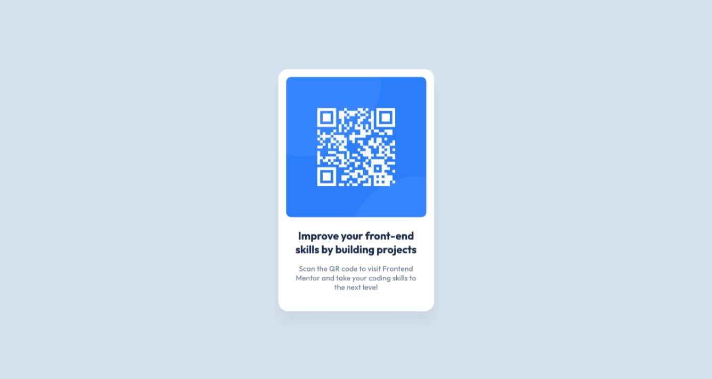

# Frontend Mentor - QR code component solution

This is a solution to the [QR code component challenge on Frontend Mentor](https://www.frontendmentor.io/challenges/qr-code-component-iux_sIO_H).

## Table of contents

- [Overview](#overview)
  - [Screenshot](#screenshot)
  - [Links](#links)
- [My process](#my-process)
  - [Built with](#built-with)
  - [What I learned](#what-i-learned)
  - [Continued development](#continued-development)
  - [Useful resources](#useful-resources)
- [Author](#author)
- [Acknowledgments](#acknowledgments)

## Overview

### Screenshot

### Links

- Solution URL: [https://joaocln88.github.io/FrontendMentor-QRCodeComponent/](https://joaocln88.github.io/FrontendMentor-QRCodeComponent/)

## My process

### Built with

- HTML5
- CSS
- Flexbox

**Note: These are just examples. Delete this note and replace the list above with your own choices**

### What I learned

- Noticed the effect of inline element on on the elements spacing.  
  When I finalized the layout, there was a small gap between the `` and the `
` in the container, although margins and padding set to 0. After some troubleshooting, found out that because `` is rendered as inline element, and then sits on a baseline.  
  <ins>Solution was to change element display to block.</ins>

### Continued development

Layout configuration with CSS

### Useful resources

- [How to get rid of the gap under the image ?](https://www.geeksforgeeks.org/how-to-get-rid-of-the-gap-under-the-image/)  
  This helped me to fix the spacing below the `` when I finished the layout.

## Author

- Github - [João Corrêa](https://www.your-site.com)
- Frontend Mentor - [@joaocln88](https://www.frontendmentor.io/profile/joaocln88)

## Acknowledgments

Thanks to Frontend Mentor, who provided the challange and all useful details to accomplish it.
